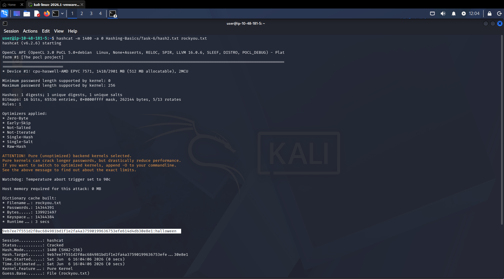

# Hashing: Data Integrity & Password Security

**Documented:** June 02, 2026 
**Focus:** Utilizing cryptographic hash functions to verify file integrity, securely store authentication credentials, and execute offline password cracking attacks.

## Overview
Unlike encryption, which is designed to be reversible, hashing is a one-way mathematical function. In this module, I explored how fixed-length digests are generated from arbitrary data, how they protect against data tampering, and the critical role they play in modern authentication architectures.

## 1. Hash Functions & The Pigeonhole Principle
I analysed the fundamental mechanics of hash functions (e.g., MD5, SHA-1, SHA-256), focusing on the avalanche effect where altering a single bit in the input drastically changes the resulting digest.
* **Collision Vulnerabilities:** I studied the mathematical necessity of hash collisions (the Pigeonhole Principle), where two different inputs inevitably produce the same output. Due to modern computational power, I learned why legacy algorithms like MD5 and SHA-1 are now considered insecure and vulnerable to engineered collision attacks.
* **Integrity Verification:** I utilized command-line tools (`md5sum`, `sha1sum`, `sha256sum`) to generate checksums. This technique is critical for validating that downloaded files or forensically captured disk images have not been altered or corrupted in transit.

## 2. Authentication & Secure Credential Storage
Storing plaintext passwords is a catastrophic security failure. I analysed how modern systems use hashing to authenticate users without ever needing to know the actual password.
* **The Rainbow Table Threat:** I explored how attackers use pre-computed dictionaries of hash-to-plaintext pairings (Rainbow Tables) to instantly reverse unsalted password hashes.
* **Cryptographic Salting:** To defeat rainbow tables, I analysed the implementation of "salting", appending a unique, random string to a password *before* it is hashed. This ensures that two users with the identical password will have entirely different hash values in the database.
* **Algorithm Selection:** I examined the shift away from fast hash functions (which benefit attackers) toward slow, computationally expensive algorithms like Bcrypt, Scrypt, and Argon2, which are designed to resist rapid brute-force attacks.

## 3. Hash Identification & System Architecture
Before a hash can be cracked, it must be properly identified. I learned how to analyse database dumps and operating system shadow files to determine the active cryptographic algorithm.
* **Linux Shadow Files (`/etc/shadow`):** I analysed the structure of Linux password storage, specifically focusing on the `$id$salt$hashed` format. I learned to identify algorithms based on their prefix (e.g., `$y$` for yescrypt, `$6$` for SHA-512, `$2b$` for bcrypt).
* **Windows NT Hashes:** I examined how Windows systems store credentials in the Security Accounts Manager (SAM) using the NTLM format, which is visually identical to MD4 but requires distinct cracking methodologies.

## 4. Offline Password Cracking
Relying on context and prefix identification, I executed offline dictionary attacks against captured hash values.
* **Hashcat Methodology:** I utilized `hashcat` to execute straight dictionary attacks (`-a 0`) using the `rockyou.txt` wordlist. I learned how to specify the exact target algorithm (`-m`) to optimize the cracking process.
* **Hardware Optimization:** I analysed the architectural differences between CPUs and GPUs in the context of cryptography, noting how the massive core count of modern GPUs makes them vastly superior for calculating millions of hash iterations per second compared to virtualized CPU environments. 
  *Figure 1: Executing an offline dictionary attack using Hashcat to recover a plaintext password from a captured hash.*