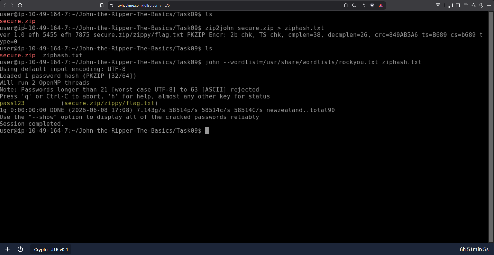

# John the Ripper: Advanced Hash Cracking & Password Recovery

**Documented:** June 02, 2026  
**Focus:** Executing dictionary attacks, deploying custom word mangling rules, and utilizing format conversion tools to recover plaintext credentials.

## Overview
While secure hash functions are computationally infeasible to reverse mathematically, they remain highly vulnerable to dictionary and brute-force attacks. In this module, I utilized the extended "Jumbo John" distribution of John the Ripper to exploit predictable human password behaviour and crack authentication hashes across multiple operating systems and file formats.

## 1. Operating System Credential Recovery
I explored how different operating systems secure local credentials and the specific preparation required to attack them.
* **Linux Shadow Hashes:** I analysed how Linux separates user data (`/etc/passwd`) from the actual password hashes (`/etc/shadow`) for security. I utilized the `unshadow` utility to combine these files into a unified format that John the Ripper can process.
* **Windows Authentication:** I examined how modern Windows environments store local user passwords in the SAM (Security Account Manager) database using the NTHash (NTLM) format. I executed targeted dictionary attacks using the `rockyou.txt` wordlist to recover these local accounts.
* **Format Identification:** Before attacking unknown hashes, I utilized Python-based identification tools (`hash-id.py`) to determine the cryptographic algorithm and passed the correct parameters to John using the `--format` flag.

## 2. Advanced Cracking Methodologies
Standard dictionary attacks are often insufficient against strict corporate password complexity requirements. To bypass this, I implemented dynamic password generation techniques.
* **Single Crack Mode:** I utilized John's single crack mode (`--single`) to leverage the GECOS field in UNIX-like systems. This mode automatically applies heuristic word mangling to known user information (such as usernames and full names) to guess poorly constructed passwords without needing a massive external wordlist.
* **Custom Mangling Rules:** I configured custom regex-style rules within the `john.conf` file to dynamically modify wordlists on the fly. By appending specific character sets (like `[0-9]` and `[!£$%@]`) and capitalizing letters, I successfully exploited the highly predictable patterns humans rely on to meet complex password requirements.

## 3. Archive & Protocol Credential Extraction
John the Ripper is not limited to raw text hashes. I utilized its suite of extraction tools to isolate and crack hashes embedded within secure files and network protocols.
* **Secure Archives:** I deployed `zip2john` and `rar2john` to extract the cryptographic hashes from password-protected compressed files, allowing me to run offline dictionary attacks against the archives.
* **SSH Private Keys:** To bypass key-based authentication protections, I utilized `ssh2john` to extract the passphrase hash from an `id_rsa` private key file. This process is critical for recovering locked SSH credentials during penetration testing engagements.
  *Figure 1: Extracting a cryptographic hash from a secure ZIP archive and executing an offline dictionary attack to recover the plaintext password.*
