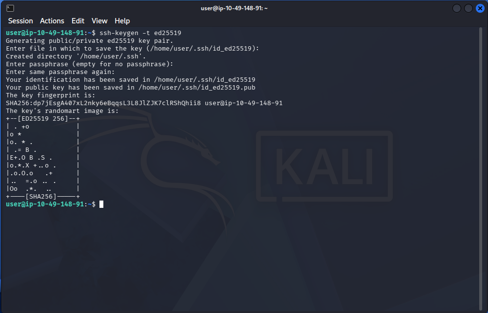

# Public Key Cryptography & Key Management

**Focus:** Implementing asymmetric encryption models, securely exchanging keys over untrusted networks, and verifying identity through digital signatures.

## Overview
While symmetric encryption is fast and efficient for bulk data, it suffers from a critical flaw: securely sharing the encryption key. In this module, I explored public key (asymmetric) cryptography to solve key distribution, enforce data integrity, and guarantee non-repudiation across digital communications.

## 1. Asymmetric Encryption & Key Exchange
To securely communicate without a pre-shared secret, I analysed how asymmetric algorithms utilize mathematically linked key pairs (a public key for locking, and a private key for unlocking).
* **RSA (Rivest–Shamir–Adleman):** I examined the mathematical foundation of RSA, which relies on the computational difficulty of factoring the product of two massive prime numbers. I learned how to identify its core variables (`p`, `q`, `n`, `e`, `d`) to understand how public and private keys are mathematically derived and applied to secure data.
* **Diffie-Hellman Key Exchange:** I analysed how two parties can establish a shared symmetric secret over an entirely public, eavesdropped channel. By combining private integers with public prime variables, both parties independently calculate the exact same cryptographic key without ever transmitting it across the network.

## 2. SSH Key Authentication
Passwords are inherently vulnerable to brute-force attacks. To secure remote administration, I implemented cryptographic authentication using SSH key pairs.
* **Key Generation (`ssh-keygen`):** I generated secure key pairs using the `Ed25519` elliptic curve algorithm, which provides robust security with a significantly smaller key footprint compared to legacy RSA keys.
* **Access Control:** I configured the `authorized_keys` file to restrict remote access exclusively to trusted cryptographic identities. This method is highly relevant in penetration testing for establishing persistent, stable, and password less access to systems.
* **Identity Protection:** I reinforced the principle that a private key (`id_ed25519`) must never leave the host system and should be encrypted with a local passphrase to protect it from offline credential theft. *Figure 1: Generating a cryptographic key pair for secure, password less remote administration.*

## 3. Digital Signatures & Public Key Infrastructure (PKI)
Encryption guarantees confidentiality, but it does not prove *who* sent the message or if the message was altered in transit.
* **Digital Signatures:** I explored how cryptographic signatures reverse the standard asymmetric flow. By encrypting a file's hash with a *private key*, anyone with the corresponding *public key* can decrypt it. If the hashes match, it mathematically proves the author's identity and confirms the file has not been tampered with.
* **TLS/SSL Certificates:** I analysed
* the Chain of Trust used in modern web browsing. By utilizing Root Certificate Authorities (CAs) to digitally sign a web server's public key, clients can cryptographically verify the identity of domains to prevent Man-in-the-Middle (MitM) attacks.

## 4. PGP and GPG (Pretty Good Privacy)
Beyond securing web traffic, I explored how asymmetric cryptography is used to secure individual communications and verify software integrity. 
* **Secure Communication:** I analyzed how PGP/GPG utilizes public-key cryptography to encrypt emails and files, ensuring that only the mathematically intended recipient can decrypt the contents.
* **Code Integrity:** I examined the process of digitally signing code and version control commits using GPG. This prevents supply chain attacks by proving a trusted developer authored the code and that no adversary has altered it.