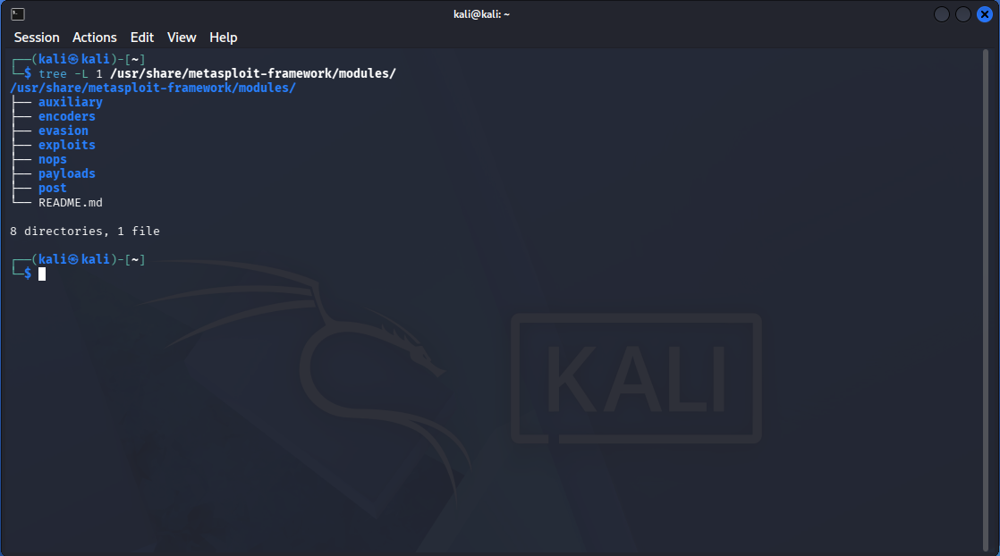

# Metasploit Framework: Comprehensive Methodology & Case Study

**Documented:** June 04, 2026 
**Focus:** Mastering the full penetration testing lifecycle using the Metasploit Framework, spanning environment configuration, vulnerability identification, weaponization, advanced in-memory payload execution, and post-exploitation analytics.

---

## Section 1: Core Framework Architecture & Navigation

The Metasploit Framework is the world's most widely adopted open-source exploitation platform, offering modular automation across every phase of a penetration testing assessment.

### Framework Distributions

* **Metasploit Pro:** Commercial enterprise edition containing a Graphical User Interface (GUI) designed to automate larger-scale baseline vulnerability validations.
* **Metasploit Framework:** Open-source, command-line interface version optimized for granular manipulation of exploits, advanced vulnerability research, and custom payload staging.

### Architectural Component Groups

Metasploit's capabilities are broken down into specialized directories located under `/usr/share/metasploit-framework/modules/`:

| Module Category | Functional Purpose                                                                            | Real-World Application Example                                                     |
| --------------- | --------------------------------------------------------------------------------------------- | ---------------------------------------------------------------------------------- |
| **Exploits**    | Code designed to take advantage of a specific system flaw to grant unauthorized access.       | Targeting an unpatched SMB service vulnerability to drop a remote shell.           |
| **Payloads**    | The code that runs on the target system *after* successful exploitation to establish control. | Dropping a reverse shell or setting up an in-memory Meterpreter agent.             |
| **Auxiliary**   | Scanners, fuzzers, sniffers, and crawlers used for information gathering and testing.         | Running a port scanner or checking if an active service is missing a patch.        |
| **Post**        | Scripts executed after initial entry to pillage the host, dump credentials, or pivot traffic. | Extracting stored local passwords or enumerating network connections.              |
| **Evasion**     | Specialized tools built to modify raw payloads to evade antivirus or host detection systems.  | Compiling an executable that alters its byte signature to bypass Windows Defender. |
| **NOPs**        | (No Operation) Instructions used to fill spacing requirements within system memory.           | Standardizing payload sizing patterns during explicit buffer overflow attacks.     |

### Filesystem Layout Verification

To map how these logical categories translate to my local environment, I verified the filesystem layout. Running a directory check (`tree -L 1`) maps out the core module paths on the host storage system: 
*Figure 1: Verifying the structural directory alignment of Metasploit framework modules on the local filesystem.*

By validating this layout on the disk, I know exactly where custom scripts or updated CVE exploits must be placed under the `/modules/` path. For example, `auxiliary/` houses scanner scripts, while `exploits/` handles targeted initial access vectors.

### Core Command Operations inside `msfconsole`

The command-line sub-shell is initialized using the `msfconsole` command. Essential workspace navigation relies on these foundational actions:

* `search`: Queries the internal database for specific vulnerabilities, CVE entries, or target platforms (e.g., `search eternalblue`).
* `use`: Loads a specific module into active workspace memory (e.g., `use exploit/windows/smb/ms17_010_eternalblue`).
* `show options`: Displays all variables, target profiles, and network values required to execute the module safely.
* `set / unset`: Controls configuration parameters globally or within local module boundaries (e.g., `set RHOSTS 10.10.10.5`).
* `setg / unsetg`: Globally sets configuration parameters so they persist automatically when switching between different exploits or auxiliary scanners.
* `show targets`: Lists the compatible operating systems, architecture restrictions, or software versions supported by the loaded exploit.

---

## Section 2: Databases & Infrastructure Management

A critical insight I gained during my environment configuration labs is that running large-scale network assessments without a backend relational database introduces massive tactical inefficiencies. Connecting Metasploit to a PostgreSQL database instance allows for systemic tracking of host records, captured credentials, and open port mappings without losing session historical data.

### The PostgreSQL Database Layer (`msfdb`)

Using Metasploit without a back-end database creates systemic inefficiencies. By initiating the PostgreSQL daemon via `msfdb init`, a local database tracks everything discovered during network enumeration:

* `db_status`: Validates the connection stability between the framework console and the PostgreSQL backend instance.
* `workspace`: Segmentizes client targets into individual data silos to avoid mixing up host data across separate penetration tests.
* `hosts`: Generates a distinct table tracking every IP address, operational status, and discovered OS platform.
* `services`: Displays a structural list of open ports, protocol states, and banner detection profiles captured across the workspace.
* `vulns`: Catalogues tracked security weaknesses and discovered service vulnerabilities mapped against specific asset entries.
* `creds`: Securely organizes cleartext passwords, password hashes, and tokens pulled during active assessment windows.

### Integrated Service Enumeration

Metasploit contains native auxiliary scanning units designed to query target systems rapidly:

* **Port Discovery:** `use auxiliary/scanner/portscan/tcp` maps open listening ports on targeted network subnets, saving live host mappings directly into the workspace tables.
* **Vulnerability Probing:** Custom auxiliary tools query software banners or perform low-impact traffic requests to evaluate system states before launching intrusive exploit modules.

---

