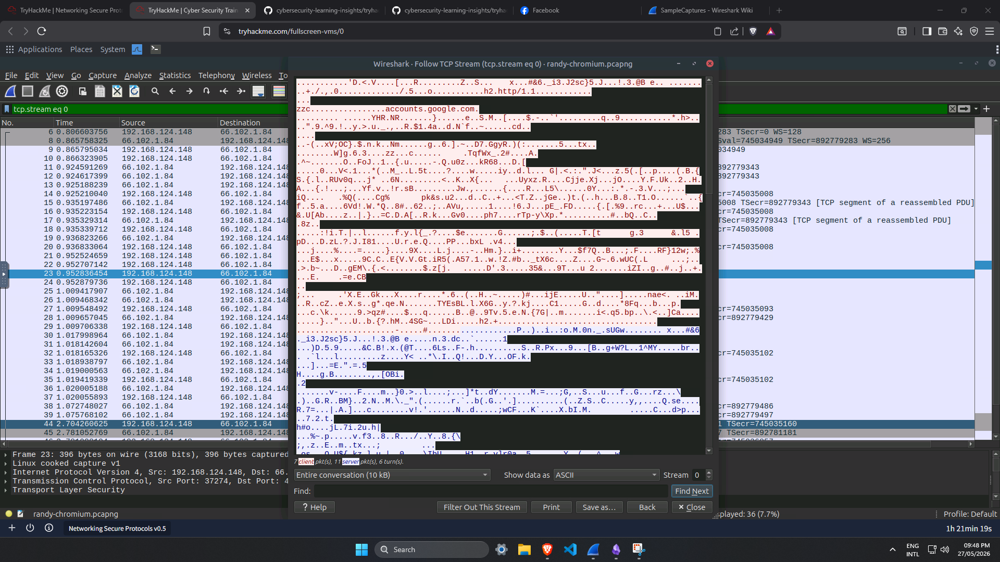
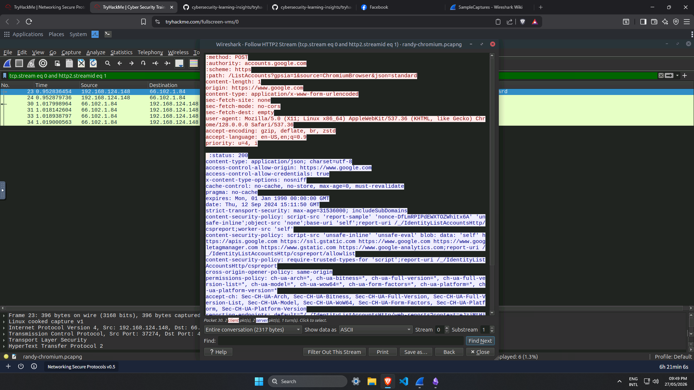

# Network Architecture & Protocol Security

**Documented:** May 28, 2026
**Focus:** Reviewing the TCP/IP suite and understanding the difference between plaintext and secure protocols.

## Overview
Before jumping into packet analysis, I needed to review the fundamental mechanics of how devices communicate on a network. Coming from an engineering background, I already understood basic routing. Because of that, my focus here was strictly on the security side. I wanted to see exactly how data is encapsulated and which common protocols leave data exposed to sniffing.

## 1. Traffic Basics & Encapsulation
* **OSI & TCP/IP Models:** Reviewed how data is wrapped (encapsulated) as it moves down the network layers. Knowing exactly where MAC addresses and IP addresses are attached is necessary for writing accurate packet filters later.
* **Addressing & Subnets:** Brushed up on how IP ranges are divided and how NAT (Network Address Translation) allows multiple internal devices to share one public IP.
* **TCP vs. UDP:** Contrasted the reliable, connection-oriented nature of the TCP three-way handshake with the faster, connectionless nature of UDP.

## 2. Core Network Protocols
* **ARP & DHCP:** Mapped out how devices get their IP settings and how IP addresses resolve to physical MAC addresses. Understanding normal ARP behaviour is important for spotting local network attacks like ARP spoofing.
* **ICMP & Routing:** Reviewed how packets travel across subnets. While ICMP is meant for network troubleshooting (like pinging a device), it is also the main protocol used for active network scanning and host discovery.

## 3. Plaintext vs. Encrypted Protocols
A major takeaway from this module was identifying everyday protocols that transmit data in cleartext. This means anyone listening on the network can read the payloads.
* **Web & Domain:** DNS translates domain names to IPs, and HTTP transfers web data. Both operate in cleartext.
* **File Transfer & Email:** FTP, SMTP, POP3, and IMAP also send data and credentials without encryption. 
* **The Secure Alternatives:** To protect data, these vulnerable protocols must be replaced with their secure versions (HTTPS, FTPS, SMTPS, IMAPS). I also reviewed how SSH replaces Telnet for secure remote administration, and how VPNs can encrypt all traffic across an untrusted network.
* **Practical Lab (TLS Decryption):** I completed a hands-on session to see this encryption in action. I loaded a session key (`ssl-key.log`) into Wireshark through the TLS protocol preferences. This allowed me to decrypt the gibberish TLS traffic and read the underlying HTTP stream in plain text.  *Figure 1: Raw TCP stream showing encrypted TLS application data before decryption.* *Figure 2: Decrypted HTTP/2 stream revealing readable data after applying the session key.*

## Applied Tooling
This theoretical baseline directly informs my applied traffic analysis workflow using tools like [Wireshark](wireshark.md), [Tcpdump](tcpdump.md), and [Nmap](nmap.md), which are documented individually in this repository.