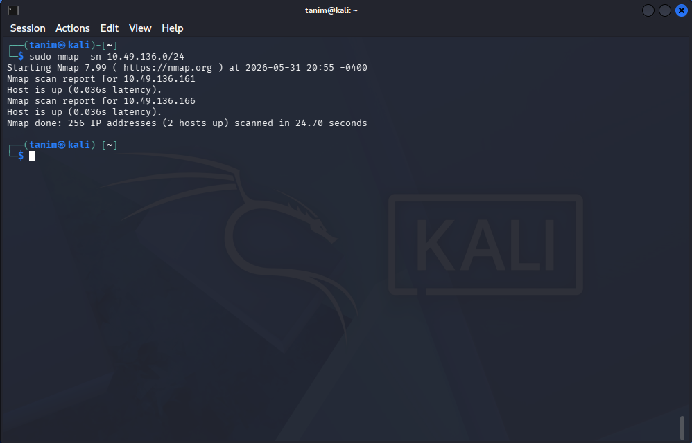
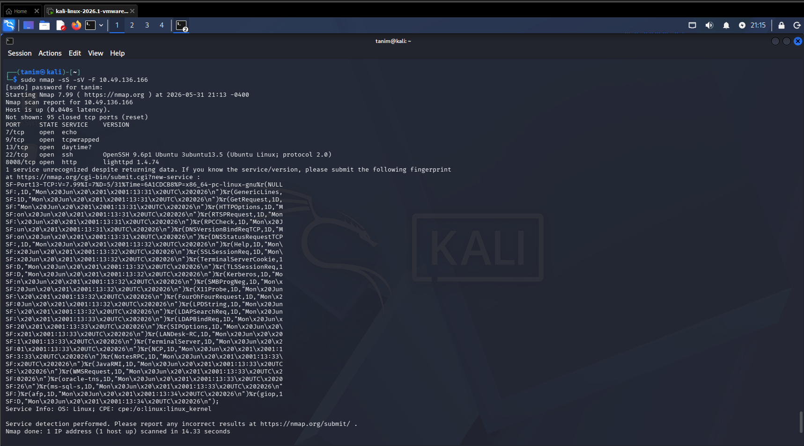

# Nmap: Network Scan & Service Identification

**Focus:** Mapping network topologies, discovering live hosts, and enumerating service versions without triggering excessive security alerts.

## Overview
While passive analysis with `tcpdump` is critical for observing live traffic, I rely on `nmap` for active network reconnaissance. In this module, I focused on systematically mapping out subnets, identifying live targets, and extracting the exact software versions running on open ports to prepare for vulnerability assessments.

## 1. Host Discovery (Who is Online?)
Before probing for vulnerabilities, I establish a baseline of live targets on the network to avoid wasting time scanning dead IP addresses.
* **Ping Sweeps:** I use the `-sn` flag to perform host discovery without executing a full port scan. This allows me to map out active IP addresses quickly and quietly.
* **Local vs. Remote Behaviour:** When scanning a directly connected subnet, `nmap` utilizes ARP requests to accurately identify live hosts and their MAC addresses. For remote networks located behind routers, it defaults to ICMP and TCP ACK pinging.
* **Bypassing Discovery Defences:** If a target drops ICMP requests to appear offline, I apply the `-Pn` flag. This forces the tool to treat the host as alive and execute the port scan regardless of ping responses. 
  *Figure 1: Executing a remote ping sweep to map active hosts on the target subnet.*

## 2. Port Scanning Techniques
Once a target is identified, I select specific scan types based on the required stealth and the target's expected firewall rules.
* **TCP Connect Scan (`-sT`):** This executes the full TCP three-way handshake. While highly reliable, it creates noisy application logs on the target server, making it easy for defenders to spot.
* **TCP SYN Stealth Scan (`-sS`):** This is my default approach. It sends a SYN packet and waits for a SYN-ACK, but immediately tears the connection down with a RST packet before the handshake completes. This bypasses many basic application logs and significantly speeds up the scan.
* **UDP Scanning (`-sU`):** Because critical infrastructure services like DNS (port 53) and SNMP (port 161) operate connectionless, I execute UDP scans to ensure I am not missing hidden attack surfaces.
* **Target Optimization:** To optimize time, I restrict scans to specific ports (like `-p 22,80,443`), well-known ports (`-p-1023`), or the top 100 fastest ports (`-F`). If absolute thoroughness is required, I scan all 65,535 ports (`-p-`). 
  *Figure 2: Utilizing a TCP SYN stealth scan combined with version detection to identify open ports and running services without completing the handshake.*

## 3. Fingerprinting & Enumeration
Knowing a port is open is insufficient; I need to identify the exact software running behind it to assess potential vulnerabilities accurately.
* **Service Version Detection (`-sV`):** I use this flag to extract the banner and specific version numbers of running services (e.g., identifying `OpenSSH 8.9p1` rather than just a generic `ssh` label).
* **OS Detection (`-O`):** By analysing subtle differences in how the target's TCP/IP stack responds to malformed packets, I can accurately fingerprint the underlying operating system.
* **Aggressive Profiling (`-A`):** When stealth is not a priority, I combine OS detection, version scanning, default script scanning, and traceroute into a single command to rapidly build a complete target profile.

## 4. Scan Optimization & Evidence Management
Large enterprise networks require careful tuning to balance speed with stealth, alongside proper documentation practices.
* **Timing Templates:** I adjust scan timing from `-T0` (Paranoid) to `-T5` (Insane) based on network reliability and the presence of Intrusion Detection Systems (IDS). For instance, slowing a scan to `-T1` prevents the rapid connection spikes that alert security operations centers.
* **Evidence Preservation:** Because terminal output is ephemeral, I consistently use the `-oA <filename>` flag. This saves the scan results simultaneously in Normal (human-readable), XML (for importing into other tools), and Grep-able formats.
* **Data Parsing:** Saving as a Grep-able file (`-oG`) allows me to use command-line tools like `grep` and `awk` to quickly extract lists of IP addresses that share specific open ports across a massive network.