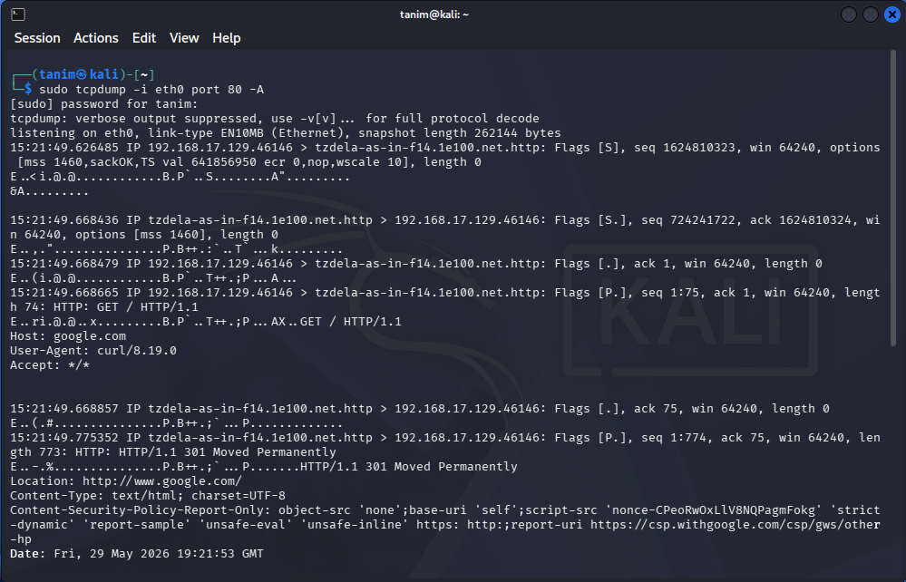
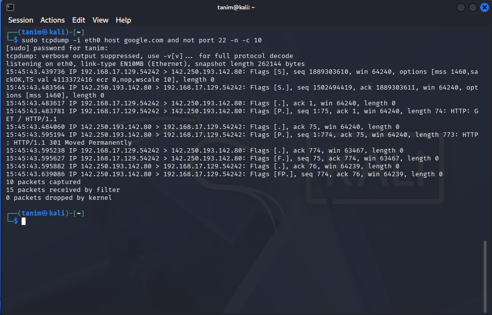
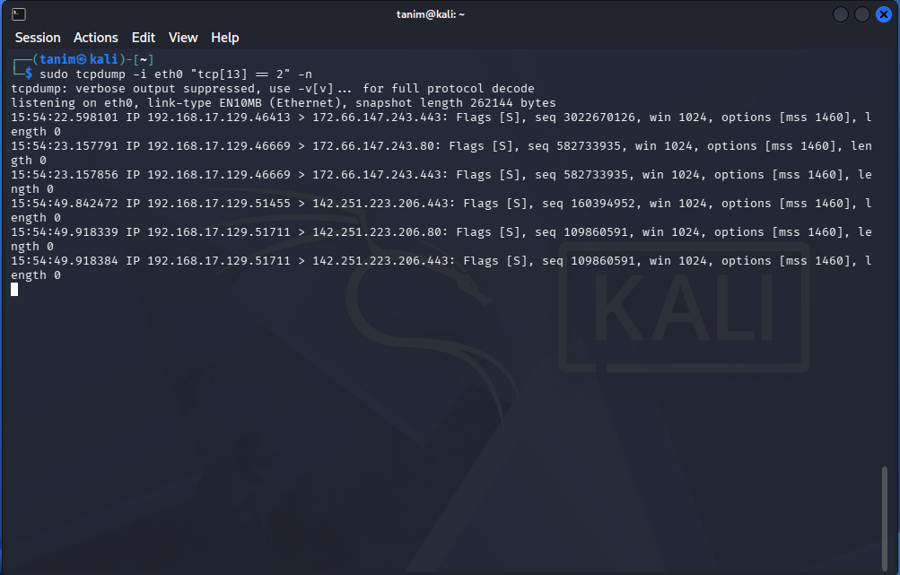

# Tcpdump: Command-Line Traffic Analysis

**Documented:** May 29, 2026
**Focus:** Capturing, filtering, and analysing network traffic directly from the Linux terminal.

## Overview
While Wireshark is great for deep visual analysis, I needed to learn how to capture traffic on headless servers where a graphical interface is not available. This module focused on using `tcpdump` to efficiently capture packets, apply strict filters to avoid capturing unnecessary data, and read raw packet bytes directly in the command line.

## 1. Core Capture Mechanics & Display
Before applying complex filters, I practiced the foundational commands required to start a capture and format the output for investigation.
* **File Management:** Used `-i` to select specific network interfaces. Because terminal output can move too fast to read, I practiced writing captures to a PCAP file (`-w`) so they can be analysed later, and reading them back (`-r`).
* **Optimization:** Used `-n` and `-nn` to stop the tool from resolving IP addresses and port numbers into hostnames. This is a critical habit because it stops `tcpdump` from generating extra DNS traffic while listening and speeds up the capture process.
* **Payload Inspection:** Because `tcpdump` defaults to showing only packet headers, I use flags like `-A` or `-X` to force the terminal to print the actual packet contents. This translates the raw packet bytes into readable text (ASCII). By doing this, I can instantly read cleartext data like HTTP requests or FTP credentials right in the terminal without needing to export the file to Wireshark.
  *Figure 1: Inspecting packet payloads in ASCII formats to identify cleartext data.*

## 2. Traffic Filtering Expressions
Capturing all traffic on a busy network creates massive files and drops packets. To prevent this, I write strict expressions using the `pcap-filter` syntax (the underlying filtering language for `tcpdump`) to surgically isolate specific communications.
* **Targeting & Services:** I filter traffic by specific endpoints using the `host`, `src`, and `dst` primitives, and isolate specific services using the `port` keyword.
* **Logical Chaining:** I combine `pcap-filter` expressions using logical operators (`and`, `or`, `not`). For example, I can capture all traffic involving a specific web server while explicitly excluding SSH (`not port 22`) to keep my capture file clean of administrative noise.
  *Figure 2: Applying logical operators using pcap-filter syntax to isolate a specific network conversation while filtering out background noise.*

## 3. Advanced Header Filtering (Byte Isolation)
Beyond basic IP and port filtering, I utilize advanced `pcap-filter` syntax to inspect specific bytes directly within the packet headers. This allows for highly granular traffic analysis, even when standard port numbers are spoofed or hidden.
* **Byte Offset Syntax (`protocol[offset:size]`):** I use this syntax to isolate specific data fields by referencing their exact mathematical position in the protocol header. By specifying the protocol (like `tcp` or `icmp`), the starting byte offset, and the data size, I can filter traffic based on low-level network behaviours rather than just routing destinations.
* **TCP Flag Isolation:** A practical application of this is filtering for specific TCP flags using binary operations. For instance, by isolating the 14th byte of a TCP header (which controls the flags) using `tcp[13]`, I can capture packets where only the SYN flag is set. This technique allows me to actively hunt for automated port scans and network mapping attempts directly from the command line.
  *Figure 3: Isolating the 14th byte of the TCP header to actively hunt for stealth SYN scans.*