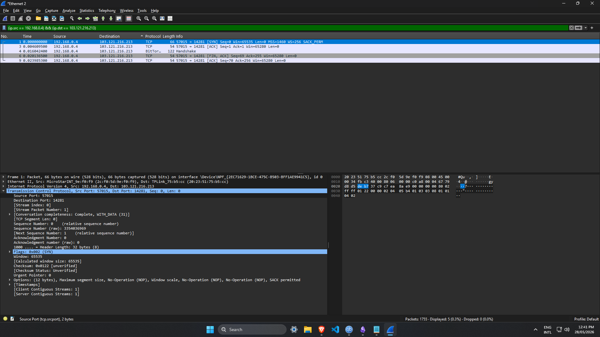

# Wireshark: Network Traffic Analysis

**Documented:** May 29, 2026 
**Focus:** Packet Dissection and Traffic Filtering

## Overview
This document covers my practical notes on using Wireshark for network traffic analysis. While Wireshark has a lot of GUI features for organizing files, my main focus was learning how to break down packets, extract payloads, and filter out noise in large packet capture (PCAP) files. 

## 1. Packet Dissection
The packet details pane in Wireshark maps directly to the OSI model, which makes it easy to read the data layer by layer. When analysing a single packet, I look at these specific layers:
* **Layer 2 (Data Link):** Shows the source and destination MAC addresses in the frame.
* **Layer 3 (Network):** Shows the source and destination IP addresses.
* **Layer 4 (Transport):** Shows the protocol (TCP/UDP) and the specific ports being used. It also highlights protocol errors here.
* **Layer 7 (Application):** Shows the actual application data being sent over protocols like HTTP or DNS.

## 2. Navigating and Extracting Data
Scrolling through a PCAP with thousands of packets is not realistic. I use a few specific features to find what I am looking for quickly:
* **Find Packets:** Searching by specific strings inside the packet bytes to locate cleartext data or specific file names.
* **Export Objects:** This is highly useful. If a file is downloaded over an unencrypted protocol like HTTP, I can use this feature to extract and save the actual file directly from the network traffic
* **Expert Info:** I use this to quickly check for network anomalies, like high numbers of TCP retransmissions or connection resets, which can indicate network scanning or dropped packets.

## 3. Stream Analysis and Filtering
This is the most important part of analysing traffic. There is a fundamental difference between Capture Filters (which drop traffic before it is recorded) and Display Filters (which just hide traffic from the current view). 

I primarily use Display Filters. Even though you can right-click almost any field in Wireshark and click `Apply as Filter`, learning the actual syntax makes the process much faster.

**Core Display Filter Syntax:**
* `ip.addr == [IP]` (Filters traffic to or from a specific IP)
* `ip.src == [IP]` (Filters strictly by source IP)
* `ip.dst == [IP]` (Filters strictly by destination IP)
* `tcp.port == 80` (Filters for HTTP web traffic)
* `http` or `dns` (Filters by protocol name) and etc. *Figure 1: Filtering packets by specific source and destination IP addresses.*

**Following Streams:**
Instead of looking at individual packets, right-clicking a packet and selecting `Follow TCP Stream` or `Follow HTTP Stream` rebuilds the entire conversation. This is the best way to read cleartext credentials or see the exact request and response of a web attack.
