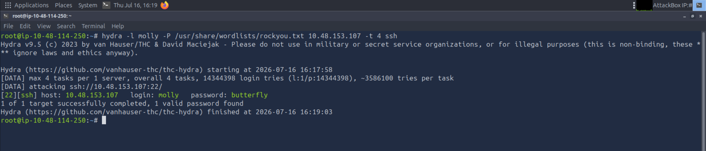
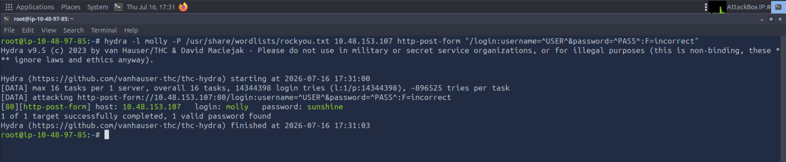

# Hydra: Advanced Brute-Force Authentication Testing

## Introduction

In this module, I focused on evaluating password strength and authentication mechanisms using Hydra, a rapid, online brute-force credential cracking utility. Unlike offline hash crackers (such as Hashcat or John the Ripper), Hydra interacts directly with live network services in real time, making it an essential tool for testing the resilience of login portals, FTP servers, and SSH endpoints against dictionary attacks.

## Section 1: Core Mechanics & Command Structure

Hydra utilizes a highly modular command-line syntax that adapts depending on the target protocol. To execute a successful brute-force attack, the tool must be fed targeted parameters dictating the user accounts, the dictionary list, and the processing speed.

### Essential Flag Configuration

When constructing an attack, I utilize the following core flags to control execution behaviour:

| Flag | Operational Description                                                      |
| ---- | ---------------------------------------------------------------------------- |
| `-l` | Specifies a targeted, single username for the authentication attempt.        |
| `-P` | Designates the absolute path to the wordlist utilized for password payloads. |
| `-t` | Sets the number of parallel tasks (threads) to optimize execution speed.     |
| `-V` | Triggers verbose output to monitor every payload delivery in real time.      |
| `-s` | Explicitly targets a non-default port number on the destination server.      |

## Section 2: Targeted Protocol Exploitation

To validate these mechanics in a live lab environment, I executed targeted brute-force attacks against two distinct authentication protocols on the target machine.

### Phase 1: Bypassing SSH Authentication

Secure Shell (SSH) is frequently targeted during infrastructure assessments. To compromise the target account (`molly`), I structured an attack using a known wordlist while throttling the thread count to maintain connection stability on the remote host.

- **Execution Logic:** This command instructs Hydra to target the SSH protocol on the specified IP, attempting to authenticate as the user `molly` using every string inside the provided dictionary file, utilizing 4 parallel threads to optimize speed. 
  *Figure 1: Executing a threaded brute-force dictionary attack against a live SSH service.*

### Phase 2: Exploiting Web Application Login Forms

Brute-forcing web portals requires significantly more configuration than standard network protocols. I utilized the `http-post-form` module, which requires mapping out the exact structure of the target's HTTP request.

To build the payload, I first used browser developer tools (specifically the Network Tab) to intercept a failed login attempt. This allowed me to identify three mandatory parameters required by Hydra:

1. **Target Path:** The specific URL of the login page (e.g., `/login.php` or simply `/`).

2. **Login Credentials:** The exact POST request body format, replacing the static typed inputs with Hydra's dynamic injection variables: `^USER^` and `^PASS^`.

3. **Invalid Response:** A static string returned by the web server when a login fails (e.g., `F=incorrect`), which Hydra uses to differentiate between a failed attempt and a successful bypass.

- **Execution Logic:** Hydra navigates to the root web directory (`/`), injects the target username and the dictionary passwords into the respective POST fields, and flags any server response that does not contain the string `incorrect` as a successful login event. 
  *Figure 2: Configuring customized payload parameters to brute-force an HTTP POST web authentication portal.*